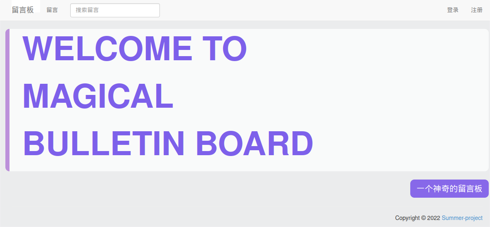
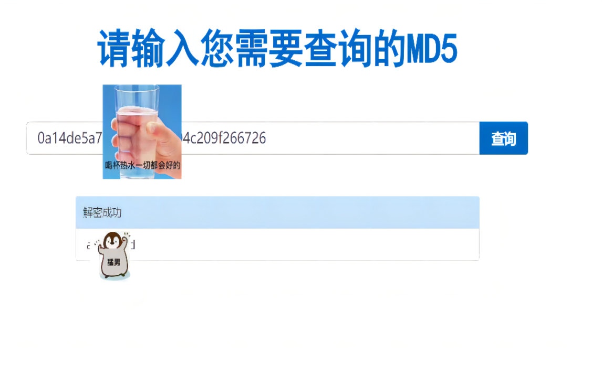

# 一个神奇的留言板
本项目是 [2022夏信息安全综合实践](https://c4pr1c3.github.io/cuc-wiki/cp/2022/index.html) 的团队成果，包含代码、说明文档、个人报告。
## 功能清单
* 基于网页的用户注册登录与管理个人信息系统
  * 允许用户注册的系统
    * 新注册的用户名强制要求不能与已存在用户名重复
    * 用户名和密码输入如果错误会有一定时间的延迟，加大暴力破解的难度
  * 禁止使用明文存储用户口令 
    * 存储的口令即使被公开，也无法还原/解码出原始明文口令
  * 允许用户修改个人信息
    * 不允许上传重复用户名
    * 通过对头像文件大小、格式、长宽的限制，保证修改的头像只能是图片，而不是其他格式的

* 基于网页的用户留言上传以及查看功能
  * 用户在网站进行留言
  * 用户可以通过关键词搜索所有用户上传的所有留言
  * 修复后排除了在留言上传过程中的 `sql` 注入的可能性
## 本项目用到的关键技术
* 前端采用原生`html`三件套进行开发，使用`bootstrap`前端框架进行页面的快速搭建，并在`css`中进行样式个性化设计，`js`文件中主要进行前端业务逻辑处理。
* 后端使用原生`php`编写，用于连接前后端数据库。
* 程序部署运行环境采用`docker`，如果本机已配置好`docker`运行时环境可以通过执行`sudo bash build.sh`自动完成程序的发布和部署；
## 快速上手体验
通过 `sudo bash build.sh` 方式部署后，打开浏览器访问: `http://localhost:9000/demo` 即可快速体验系统所有功能。
>`手动配置过程见附录-2`
## 演示
* 三分钟演示！一个神奇的留言板！
[](https://www.bilibili.com/video/BV16a411f7rV)
* 三分钟破解！一个神奇的留言板！
[](https://www.bilibili.com/video/BV1ze4y1D7iV)
## 附录-1 项目测试验证环境信息
```
Client:
 Version:           20.10.14+dfsg1
 API version:       1.41
 Go version:        go1.18.1
 Git commit:        a224086
 Built:             Sun May  1 19:59:40 2022
 OS/Arch:           linux/amd64
 Context:           default
 Experimental:      true

Server:
 Engine:
  Version:          20.10.14+dfsg1
  API version:      1.41 (minimum version 1.12)
  Go version:       go1.18.1
  Git commit:       87a90dc
  Built:            Sun May  1 19:59:40 2022
  OS/Arch:          linux/amd64
  Experimental:     false
 containerd:
  Version:          1.6.6~ds1
  GitCommit:        1.6.6~ds1-1
 runc:
  Version:          1.1.3+ds1
  GitCommit:        1.1.3+ds1-2
 docker-init:
  Version:          0.19.0
  GitCommit:        

VirtualBox : Linux kali 5.15.0-kali3-amd64 #1 SMP Debian 5.15.15-2kali1 (2022-01-31) x86_64 GNU/Linux
Mysql : Ver 14.14 Distrib 5.7.24, for Linux (x86_64) using  EditLine wrapper
PHP : PHP 8.1.2 (cli) (built: Jan 27 2022 01:00:14) (NTS)
Python : Python 3.9.10
Apache2 : Server version Apache/2.4.54 (Debian)
```
## 附录-2 配置本项目
```shell
#!/bin/bash
# build.sh
# 下载安装docker
sudo apt-get install docker.io
# 进入镜像文件
cd docker/demo
# 使用Dockerfile 创建镜像
sudo docker build -t demo:v3 .
# 创建并运行
sudo docker run -d --name test -p 9000:80 demo:v3
# 查看运行状态
sudo docker ps
# 浏览器访问localhost:9000/demo
```
## 附录-3
