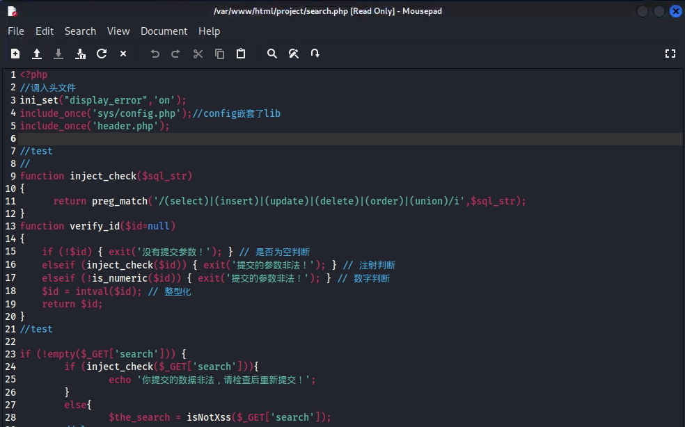
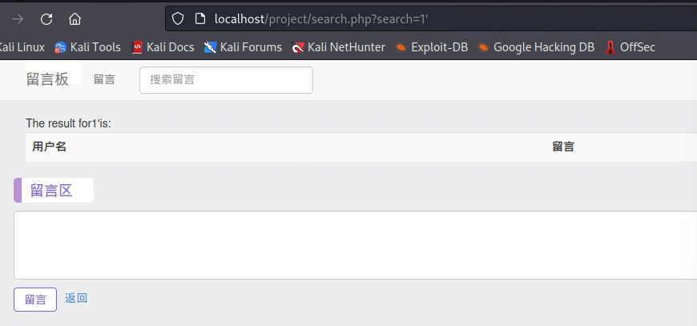
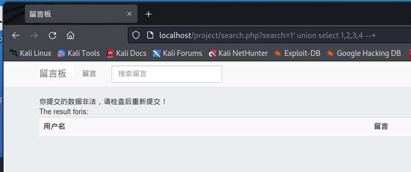
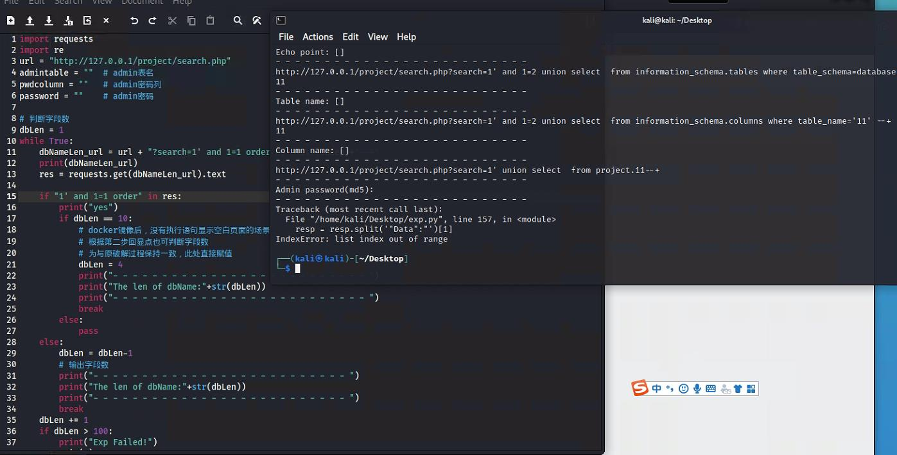

# sql修复

- 根据 break 组工作记录，需要修复 sql 注入漏洞，主要是针对 search 输入语句如 select、order 一类做拦截，阻止查询数据库的动作

- 在文件`search.php`做修改，加入过滤语句
  
  

- 修改后使用 sql 注入语句测试修复效果
  
  
  
  输入'后有回显
  
  
  
  输入 order 语句被拦截，无法查询数据库
  
  
  
  输入 search 语句同样被拦截，无法查询表名等数据

- 测试运行自动化 break 脚本`exp.py`
  
  
  
  无法完成漏洞攻击
