# 信息安全综合实践--创新实践能力团队赛总结报告

## 实验内容

根据实验要求，使用原生`php`语言以及`mysql`搭建了可供小组`BreakIt`和`FixIt`的网站

## 对团队的贡献

* 前期搜集材料，调研选定漏洞类型

* 完成了`BuiltIt`网站设计的大部分工作(除前端美化)以及部分漏洞完善(非FixIt)

* 在自己虚拟机上确定了本次在kali linux环境的手动部署并教会小组同学如何去搭建环境，节约了项目的工作时间

* 参与了本次docker镜像搭建的工作

## 个人工作总结

* 在小组分工中，我的任务是设计整个网站(BuildIt)的大部分工作，包括网站的搭建、前端设计、部分漏洞修补，以及参与了最后docker镜像的设计，但是由于个人工作量太大、不得已参考了其他的网站进行了二次开发

## 需求分析

1. 用户登录和注册的仿真性和安全性

2. 用户留言和搜索留言的便捷性

3. 用户使用出错或者不符合网站使用要求的给出友好提示

## 功能清单

* 基于网页的用户注册登录与管理个人信息系统
  * 允许用户注册的系统
    * 新注册的用户名强制要求不能与已存在用户名重复
    * 用户名和密码输入如果错误会有一定时间的延迟，加大暴力破解的难度
  * 禁止使用明文存储用户口令 
    * 存储的口令即使被公开，也无法还原/解码出原始明文口令
  * 允许用户修改个人信息
    * 不允许上传重复用户名
    * 通过对头像文件大小、格式、长宽的限制，保证修改的头像只能是图片，而不是其他格式的

* 基于网页的用户留言上传以及查看功能
  * 用户在网站进行留言
  * 用户可以通过关键词搜索所有用户上传的所有留言
  * 修复后排除了在留言上传过程中的 `sql` 注入的可能性

## 页面思维导图

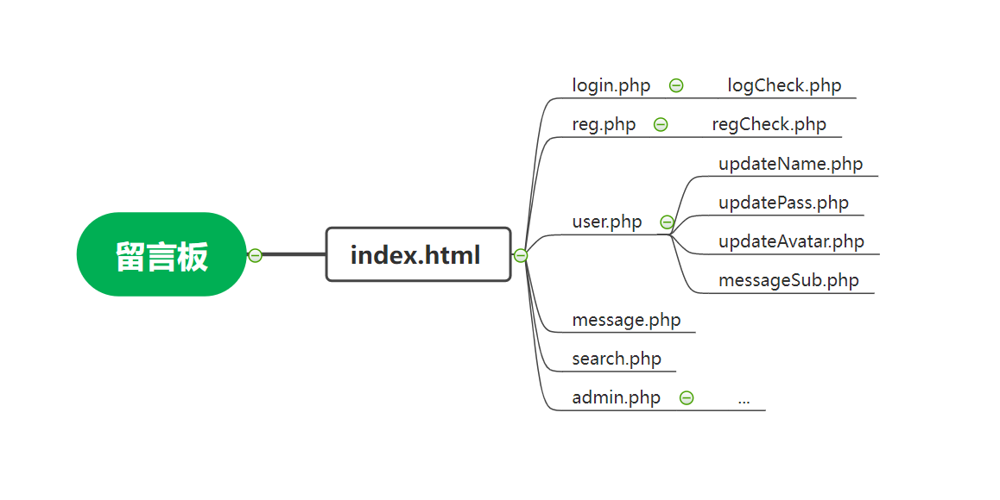

## 表结构设计

* 以下是管理员表结构设计
   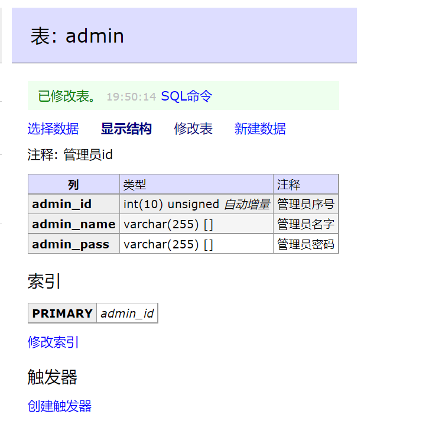

* 留言表结构设计
   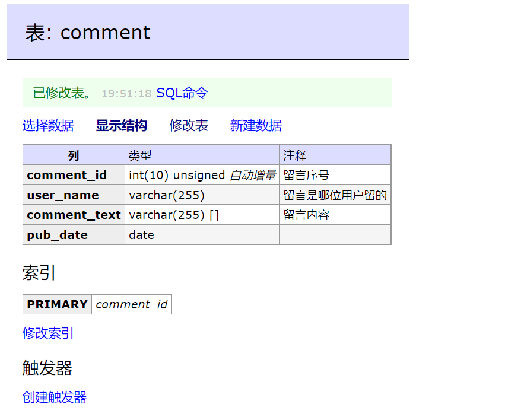

* 用户表结构设计
   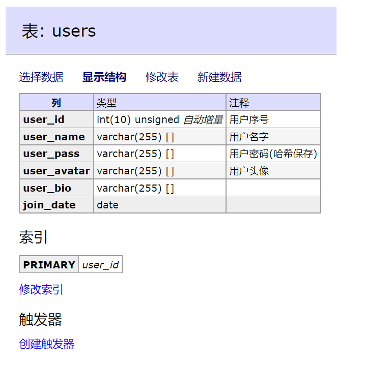

* ER图:
   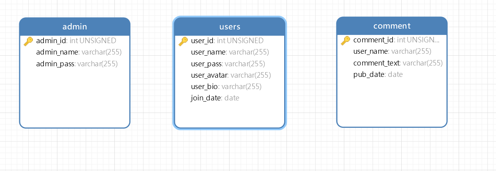
   
## 实验过程

### 网站设计思路

* 使用php原生语言进行开发

* 为了完成本次`BulidIt`的工作，加上前期以及选定的`sql`漏洞类型，很自然的联想到查询，于是得到了留言板这个初始的设计方向

* 同时为了更加有实用价值以及仿真感，我们加入了`user`和`admin`的角色

* 为了提供`sql注入`的环境，我们设计了`搜索框`这一入口供后续`sql注入`攻击

* 后续完善了其他的漏洞(除`FixIt`部分)

> 在搭建好了属于我们自己的网站之后，面临着更大的问题，这个初始网站是包含许多漏洞的，sql注入，csrf,暴力破解等等...所以还面临着完善漏洞的过程，即只留下一个可用性强的漏洞供后续同学的BreakIt的过程

### XSS漏洞完善

* 由于输入框的存在，很容易联想到XSS型漏洞，这类漏洞能够使得攻击者嵌入恶意脚本代码到正常用户会访问到的页面中，当正常用户访问该页面时，则可导致嵌入的恶意脚本代码的执行，从而达到恶意攻击用户的目的

* 很简单的例子通过`<script>alert('xss')</script>`,得到了网站弹窗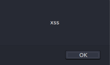

* 很简单的思路就是设置关键词过滤，但是可以利用很多方式过滤，比如双写，大小写等方式逃避过滤

```html
<scr<script>ipt>alert("XSS")</script>
<sCript>alert("XSS")</script>
```

* 所以更好的办法，就是使用htmlspecialchars函数把预定义的字符&、”、 ’、<、>转换为 HTML 实体，防止浏览器将其作为HTML元素
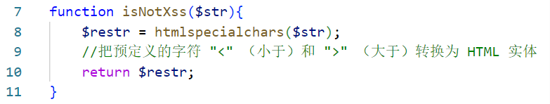

### 权限跨越完善

* 在用户名设置防止用户更改名字为`更高级别`的用户，如`admin`，`root`。所以不允许用户更改相同的姓名

* 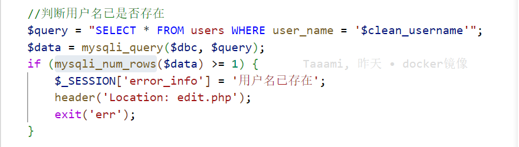 所以在此处进行了对输入的用户名的检测，如果`mysqli_num_rows`返回的行数大于1，则说明有所重复

* 值得一提的是，我在写php的时候，错将`$clean_name`写为`clean_name`，在朱庭萱同学的指正下，修改了过来

* 在注册的部分同样防止了权限跨越漏洞

### 暴力破解完善

* 在暴力破解的防护中，这里并未做出特殊的防护手段，只是在验证密码出错后，`sleep(4)`以加大黑客暴力破解的难度

* 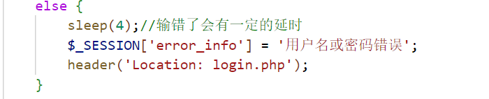

### 文件上传漏洞完善

* 由于在上传头像的过程中，需要上传文件，但是上传文件的过程中，容易被黑客恶意的上传脚本或者不符合要求的头像

* 首先我们需要通过`strtolower`判断后缀是不是`jpg`格式的

* 但是这个容易被被黑客伪造，比如将一个`php`文件修改后缀后上传，所以我们还需要通过`getimagesize`验证长宽和文件本身大小，来进行文件上传漏洞的完善

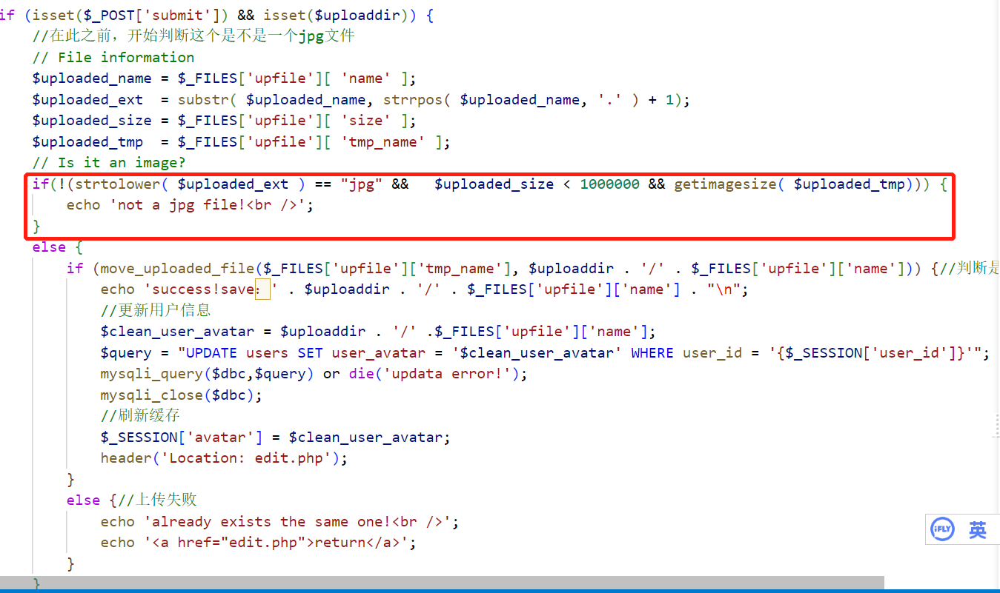

### 使用散列表的形式保存密码

* 由于存在着数据库泄露的风险，所以选择使用哈希值得格式来存储我们的密码，这样的话即便数据库泄露也不会有丢失密码的风险

* 由于需要留下`sql注入`漏洞，所以选择的密码是`adminpwd`弱口令便于小组同学进行破解

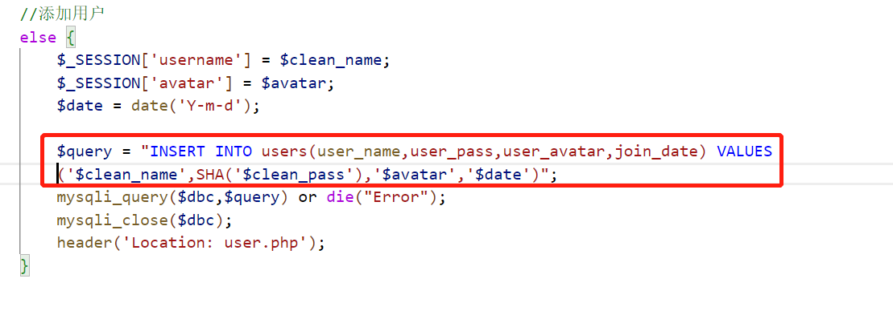

## 遇到的问题

### Apache+php+mysql环境搭建(windows)

1. 虽然已知在`kali linux`环境下搭建`lamp`环境是一件很简单的事情，但是由于习惯于在`windows`使用`VScode`进行代码开发所以还是在windows上也搭建了环境方便快速调试

2. 但是在php加载mysql出现了一个问题：已经修改了php.ini文件，而且重启了，但是并没有在phpinfo()里看到mysql模块
   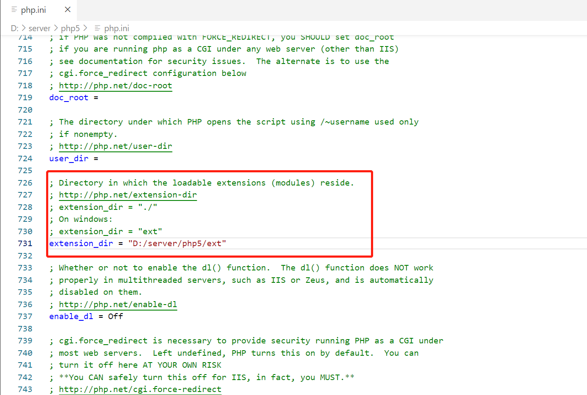
   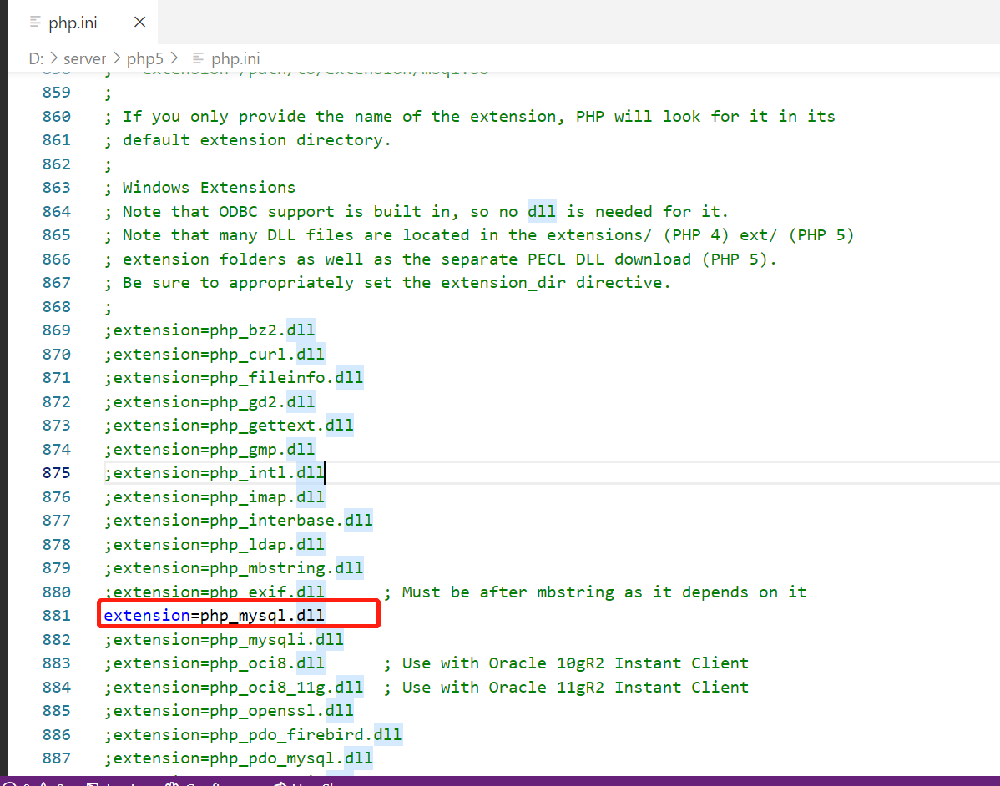
   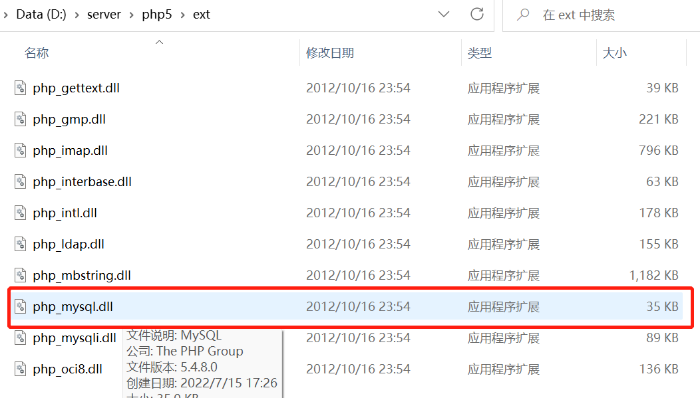
   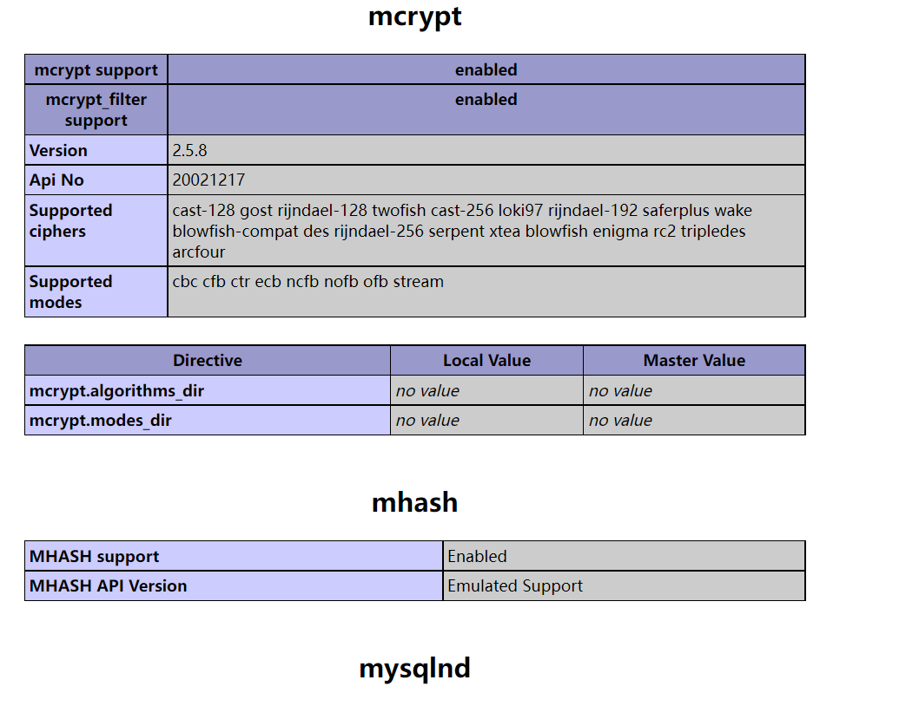

3. 询问老师后，检查，发现我的`php.ini`存在于错误的位置改变位置后，解决

### 修复SQL漏洞遇到的一个问题

1. 由于作为制造漏洞的人，也要验证该漏洞的可修复性，所以我在之前也尝试了，SQL漏洞的修复

2. 我与`FixIt`小组的同学，想法不同，他是想通过`语句过滤`直接排除漏洞，我尝试的是基于PDO语法修复SQL漏洞,我只要提前编译好，不管黑客在前端输入什么都是我预编译好的语句
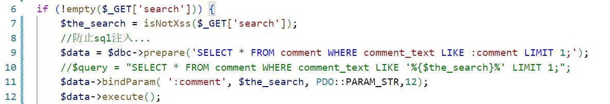

3. 但是遇到了这样的问题`Fatal error: Call to a member function bindParam() on a non-object in D:\server\apache\htdocs\project\search.php on line 11`

4. 在老师的提醒下，`like 条件通常会使用% 进行模糊匹配`，解决了该问题

## 学习收获

1. 在学习网站构建的过程中，因为我对于`php+apche+mysql`这样的服务器是`0基础`的，所以学习的过程中，收获特别大。从服务器的搭建(windows和kali linux双系统)，到php+mysql代码的完善，再到漏洞的修复深入理解php代码，最后再到参与`docker`镜像的设计，体会了一个完整的网站是如何诞生的过程

2. 在设计表结构的过程中，也学习到了`navicat15`、`adminer`等表结构设计工具的使用，也同样提醒我不要`闭门造轮`，要善于使用搜索引擎

3. 最后给我印象最深的却是`docker`镜像设计部分，我们不是一开始就确定要使用一个`lamp`的`docker`镜像的，一开始是打算使用一个`kali`官方镜像，但是这个镜像在我拖入系统后才发现里面是空的，连`sudo`和`vim`语句都没有，走了很多弯路才反应过来，原来`docker hub`里有很多搭建好的`lamp`镜像，这端经历再次提醒我要善用搜索引擎！

4. 同样在搭建网站和修复漏洞的过程中，也更加理解了作为攻击者该如何攻击对应的网站漏洞

5. 纸上得来终觉浅，在实践之后才能真正的提升自己!

## 参考资料

1. [php+mysql环境搭建(win)和代码学习](https://www.bilibili.com/video/BV18x411H7qD?spm_id_from=333.337.search-card.all.click)

2. [参考的网站](https://github.com/redBu1l/ZVulDrill)

3. [自己的dwva笔记](https://github.com/2019CUCCS/re-exp-lsw666-gif/tree/chapter10/chapter10#dom-based-cross-site-scripting-xss)

4. [当Docker运行碰上“连接被重置”](https://blog.csdn.net/e_mmm0629/article/details/114404814)

5. [PDO技术](https://www.php.net/manual/en/ref.pdo-mysql.php)

6. [XSS漏洞](https://blog.csdn.net/why_still_confused/article/details/107444888)

7. [Docker教程](https://www.runoob.com/docker/docker-tutorial.html)