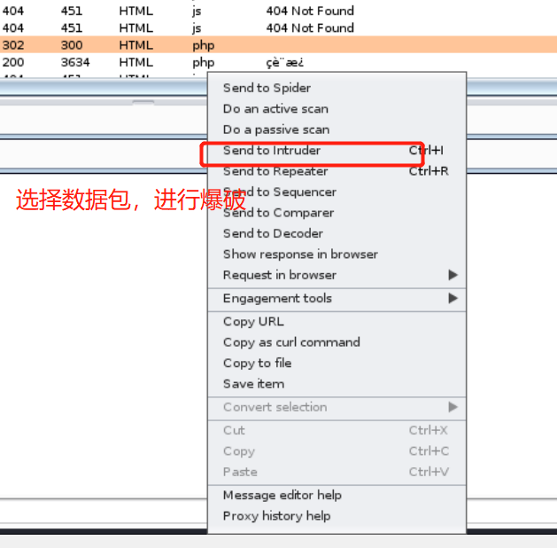
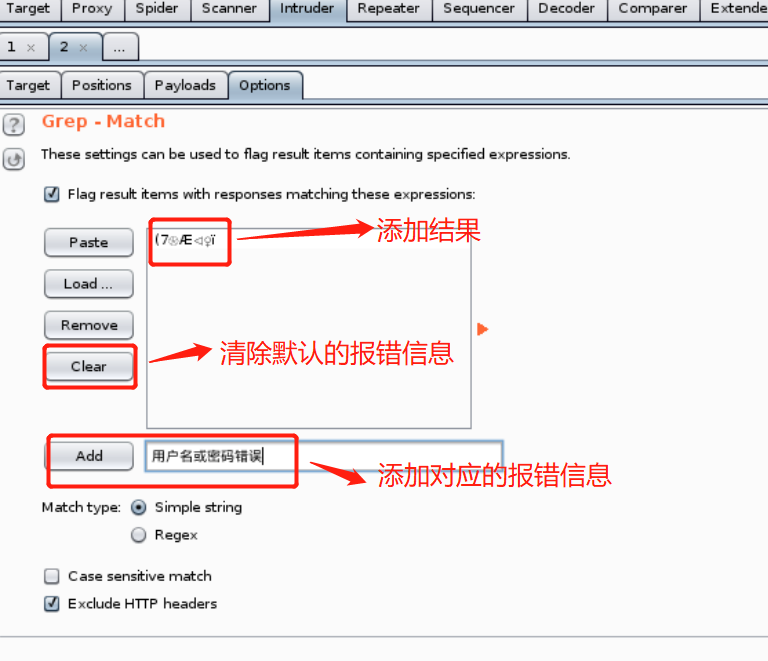

# 信息安全综合实践--创新实践能力团队赛总结报告

## 一、 实验内容

本次实践作业中，小组成员使用 *PHP*、 *Python*、 *Java* 等常用编程语言实现，利用 *Apache* 服务器和 *MySQL* 后端数据库，搭建了一个 Web 应用服务场景，提供注册或登陆用户、编辑用户信息、编辑或搜索留言的服务。  
该 Web 应用服务场景存在 **sql注入漏洞**，但漏洞的攻击方式 **只有一种** ，成员编写了 **exp** 脚本文件实现漏洞攻击。在此之后，小组成员修复该漏洞，使原本的漏洞攻击方法不能成功。

## 二、 个人工作总结

在本次实践中，本人负责漏洞攻击的部分工作，主要针对 **CSRF**、 **后台弱口令**、 **目录遍历** 和 **sql注入** 四种类型的漏洞进行漏洞攻击，检测是否存在漏洞并分析漏洞攻击失败的原因（分析可能采用的漏洞修复方法）。

### 2.1 CSRF 漏洞检测

#### 2.1.1 CSRF 漏洞介绍

> CSRF(Cross-site request forgery，跨站请求伪造)，通过伪装受信任用户向网站发出请求，实现非法操作。  
CSRF 诱骗受信任用户访问包含攻击代码的网页或链接，获取受信任用户未失效的身份认证信息（ cookie、session 等信息），伪装受信任用户向网站发送请求，完成非法操作。

#### 2.1.2 CSRF 漏洞攻击过程

1. 进入修改密码页面，尝试修改密码，利用 burpsuite 抓包。得到对应的请求信息，用户 oy 的密码是 12345。利用 burpsuite 的 Generate CSRF POC 功能生成 CSRF 攻击脚本。


2. 在构造好的攻击脚本中，可以通过直接修改 value 值，任意修改用户的新密码为 123 ，修改完成后进行测试。原本

3. 复制 url，在代理浏览器中打开 url，查看攻击是否成功。


4. 返回用户登陆界面，利用密码 123 登陆，显示密码错误，表示攻击失败。


#### 2.1.3 CSRF 漏洞的修复方法

1. 添加 token 随机值 <br />
在请求中加入了随机产生的 token 值，服务器接收到请求之后将验证 token 值，缺少 token 值或 token 值错误都会导致服务器端拒绝请求。另一方面， token 值不包含在 cookie 中，攻击者无法直接利用 cookie 通过验证。
2. 添加 referer 校验 <br />
在 http 请求中利用 referer 记录 http 请求的来源地址，服务端可通过校验 referer 值，判断请求是否来自同一个浏览器，以此防御 CSRF 攻击。

### 2.2 后台弱口令漏洞检测

#### 2.2.1 后台弱口令漏洞介绍

> 弱口令攻击可分为两类：一类是利用常见的默认密码或简单密码字典进行爆破攻击，从而登陆管理员账号，进行非法操作；另一类是通过输入万能密码，构造语句，绕过登陆验证，直接登陆管理员账号。

#### 2.2.2 后台弱口令漏洞攻击过程

1. 尝试登陆用户 admin 账号，利用 burpsuite 抓包，密码错误提示为「用户名或密码错误」。

2. burpsuite 进行爆破攻击，设置爆破位置为 `usr`  `pwd`、添加 [弱口令字典](./simple_pwd.txt)、添加错误提示，开始爆破。



3. 观察爆破结果，寻找返回信息不同的密码，尝试登陆 admin 账号，登陆失败。


4. 猜测后台登陆验证语句：获取输入的用户名和密码，与数据库中存储的用户名、密码比较，若一致则成功登陆，否则返回错误提示信息。尝试使用万能密码构造语句，绕过登陆验证。
```

# 例如登陆验证语句为
select* from Manage_User where UserName='xxx' And PassWord='xxxxx'
# 输入用户名 'or'='or' 验证语句变为  
select* from Manage_User where UserName=''or'='or'' And PassWord='xxxxx'
# 验证逻辑变为：(假or真or假and(真/假))=真，绕过密码验证。
```
5. 重复上述步骤，将密码字典更换为 [万能密码字典](./pwd.txt)
6. 爆破结果中没有特殊值，攻击失败


#### 2.2.3 后台弱口令漏洞的修复方法

1. 完善后台登陆验证的代码，例如：获取输入的用户名和密码后，首先在数据库中查找用户是否已经注册，若已注册，单独验证密码是否一致，若该用户未注册，则返回错误信息。
2. 在数据库中存储加密之后的用户密码，不直接存储密码。在登陆验证过程中，先验证用户是否注册，若存在，则将获取的密码做加密运算之后，与数据库中的密文比较，一致则通过验证。
3. 设置管理员账号密码时，避免使用常见的简单密码。在用户注册时增加安全口令的限制，例如：口令不能为空、不能为连续字符、至少包含大小写字母，数字和特殊字符等等。（本次 Web 应用场景并无此限制）
4. 对登陆设置账户锁定，在连续输入错误密码后，限制一段时间之后才能尝试登陆。（本次 Web 应用场景并无此限制）

### 2.3 目录遍历漏洞检测

#### 2.3.1 目录遍历漏洞介绍

> 一些 Web 应用对服务器文件具有读取的功能，以文件名作为参数传递。在服务器接受到文件名之后，Web 应用程序会自动补全文件路径，并返回读取的结果。攻击者可以通过在文件名中加入 `~/`，`../` 等特殊字符，实现访问服务器文件。

#### 2.3.2 目录遍历漏洞攻击过程

1. 在上传头像页面打开源码，发现存在目录 `/images`

2. 在url中输入 `../images/default.jpg` ，能够查看 jpg 文件，输入 `../images/` 返回显示无权限查看。


3. 在 search 页面发现搜索内容作为参数传递，burpsuite 抓包，构造 payload，修改 url，添加 `../../../../etc/passwd`、`....//....//....//etc/passwd`、`..%252f..%252f..%252fetc/passwd`，尝试访问 /etc/passwd 文件夹。访问失败。


#### 2.3.3 目录遍历漏洞的修复方法

1. 对用户输入进行验证，过滤特殊字符如 `../` 和 `~/`。
2. 采用白名单对所有输入进行验证。
3. 对用户传递的文件名参数统一编码，拒绝包含恶意字符的参数。

### 2.4 sql 注入漏洞检测

#### 2.4.1 sql 注入漏洞介绍

> 攻击者通过控制由 Web 前端传入后端的参数来构造 sql 语句，被程序代入数据库中查询信息，从而实现对数据库的任意操作。

#### 2.4.2 sql 注入漏洞攻击过程

1. 在 search 页面的搜索框中输入 `'` 发现不显示结果，开始攻击。判断字段数。
```

# 输入
1' and 1=1 order by 2 --+
1' and 1=1 order by 3 --+
1' and 1=1 order by 4 --+
1' and 1=1 order by 5 --+   # 无回显，表明有4个字段。
```
2. 输入 `-1' union select 1,2,3,4-- ` 查看回显点

3. 输入 `1' union select 1,group_concat(table_name),3,4 from information_schema.tables where table_schema=database() -- ` 查看表名，分别为：admin，comment，users。

4. 输入 `1' and 1=2 union select 1,2,group_concat(column_name),4 from information_schema.columns where table_name=‘admin’ -- ` 查看表项为 admin_id、admin_name、admin_pass。

5. 输入 `-1' union select 1,group_concat(admin_id,0x3a,admin_name,0x3a,admin_pass),3,4 from project.admin-- ` 查看管理员 admin 的 id、name、passwd。

6. 用在线工具解密，得到 admin 真正的 passwd。


#### 2.4.3 sql 注入漏洞的修复方法

（本次实践后续会修复 sql 注入漏洞。以下是个人对 sql 注入漏洞修复方法的总结。）
1. 对用户输入进行检查，转换或者过滤单引号、双引号、冒号等字符，对于 select、update 等字符进行过滤，确保数据库的安全性。
2. 用户输入的参数不直接写入查询语句中，可以采用参数传值的方式传递变量，避免 sql 注入。
3. 对用户进行分级管理，严格限制用户权限，对于普通用户值开放数据库查询的权限，禁止建立、修改、删除数据库等权限。

## 三、实验中的问题与解决办法

### 3.1 在 kali 中安装 burpsuite pro

#### 3.1.1 问题描述

kali 自带的 burpsuite 是社区版，缺少 Generate CSRF POC 模块，需要安装 burpsuite pro。

#### 3.1.2 安装过程

1. 下载 burpsuite 和 jdk 安装包，将两个安装包放在 `/root` 文件夹下。
```

# 解压缩 jdk 安装包并移动至 '/opt'下
tar -xzvf jdk-8u191-linux-x64.tar.gz
mv jdk1.8.0_191 /opt
cd/opt/jdk1.8.0_191

# 安装 gedit
apt-get install gedit
```

2. 输入 ` gedit ~/.bashrc` 并在文件末端添加以下内容，保存后退出。
```

# install JAVA JDK
export JAVA_HOME=/opt/jdk1.8.0_191
export CLASSPATH=.:${JAVA_HOME}/lib
export PATH=${JAVA_HOME}/bin:$PATH
```

3. 回到 `/opt` 目录下，执行 `source ~/.bashrc` 。
```

# 安装并注册
update-alternatives --install /usr/bin/java java /opt/jdk1.8.0_191/bin/java 1

update-alternatives --install /usr/bin/javac javac /opt/jdk1.8.0_191/bin/javac 1

update-alternatives --set java /opt/jdk1.8.0_191/bin/java

update-alternatives --set javac /opt/jdk1.8.0_191/bin/javac
```


4. 解压 burpsuite 安装包，将解压后的文件放置在同一文件夹下。

5. 将 burpsuite 解压得到的两个 .jar 文件移动到 `/usr/bin` 目录下 ，进入该目录，启动 burpsuite 安装。


### 3.2 root 用户名更改，高亮、当前路径不显示

#### 3.2.1 问题描述

1. 虚拟机中有 root 和 kali 两个用户，其中 root 用户的终端显示异常，没有高亮、也不显示当前路径，且 root 用户名称变为 kali 与普通用户重复。容易混淆的同时，也不方便 root 用户操作。

2. 用普通用户 kali 的 `.bashrc` 文件替换 `/root/.bashrc` 后执行，没有变化。询问老师后，用正确的 root 的 `.bashrc` 文件替换了 `/root/.bashrc` 后，执行 `source .bashrc` 依旧报错。再次询问老师，发现 kali 默认的 shell 不是 bash，而是 zsh。zsh 需要自己的配置文件 zshrc。

#### 3.2.2 安装Zsh

1. 安装 zsh 并设置为系统默认 shell。
```

apt-get install zsh # 安装 zsh
which zsh    # 找到 zsh 的所在路径
chsh -s /usr/bin/zsh    # 把 zsh 作为默认 shell
```
2. 编辑 oh-my-zsh 的[安装脚本](./install.sh)，给予脚本可执行权限并执行脚本，安装 oh-my-zsh
```

vim install.sh # 编辑 oh-my-zsh 安装脚本
chmod +x install.sh    # 增加可执行权限
./install.sh    # 执行脚本，开始安装 oh-my-zsh 
```


3. 编辑 .zshrc 文件，选择喜欢的主题，重启。


## 四、心得体会

> 通过这次暑期实践的学习，我对与之前学习的网络安全和移动互联网安全有了进一步的了解。之前在各种不同的靶场环境下对于 Web 应用漏洞的练习，在这次的实践中又一次复习。与之前云里雾里、照猫画虎的练习不同，这次的实践要求复刻现实中漏洞检测的过程，是包含了各类漏洞练习的综合训练，需要个人自己寻找可能存在的漏洞，漏洞的类型和位置都是未知的。小组线上合作的形式也给这次实践增加了些许难度，任务完成的独立性更高了。<br />对于我个人而言，这次暑期实践在让我复习之前的网络安全知识、将分散的各类漏洞知识联系融合的同时，也让我对各类漏洞的修复方法有了进一步的了解，这是在之前的实验或练习中所缺少的。攻防是相辅相成的两面，对于漏洞攻击和修复的学习，都共同深化了个人对于网络安全问题的理解掌握。在此也感谢小组其他成员和老师对我的帮助！

## 五、参考资料

1. [CSRF 漏洞攻击一](https://mbd.baidu.com/ma/s/M49JtbhG)
2. [CSRF 漏洞攻击二](https://mbd.baidu.com/ma/s/r0h4Bdwn)
3. [burpsuite 爆破攻击](https://zhuanlan.zhihu.com/p/25141158)
4. [万能密码](https://www.hacksec.cn/Penetration-test/30.html#:~:text=%E6%89%80%E8%B0%93%E4%B8%87%E8%83%BD%E5%AF%86%E7%A0%81%E5%B0%B1%E6%98%AF,%E6%89%80%E4%BB%A5%E7%A7%B0%E4%B9%8B%E4%B8%BA%E4%B8%87%E8%83%BD%E3%80%82)
5. [弱口令漏洞修复](https://mbd.baidu.com/ma/s/I2KlaQsE)
6. [目录遍历漏洞检测](https://blog.csdn.net/weixin_50464560/article/details/119717089?utm_medium=distribute.pc_relevant.none-task-blog-2~default~baidujs_baidulandingword~default-0-119717089-blog-105957183.pc_relevant_multi_platform_whitelistv1&spm=1001.2101.3001.4242.1&utm_relevant_index=3)
7. [sql 注入攻击一](https://zhuanlan.zhihu.com/p/43049780)
8. [sql 注入攻击二](https://blog.csdn.net/m0_46371267/article/details/120995796)
9. [sql 漏洞修复](https://blog.csdn.net/weixin_52084568/article/details/123644522)
10. [kali 中安装 burpsuite pro](https://blog.csdn.net/Richard_qi/article/details/104663060)
11. [kali 中安装 Zsh](https://blog.csdn.net/weixin_44288604/article/details/107960185)
