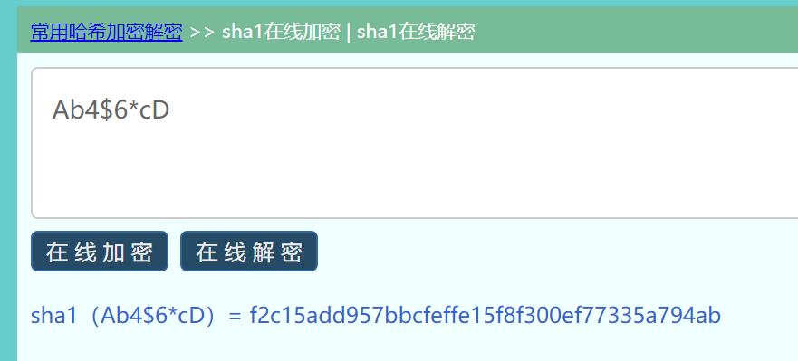
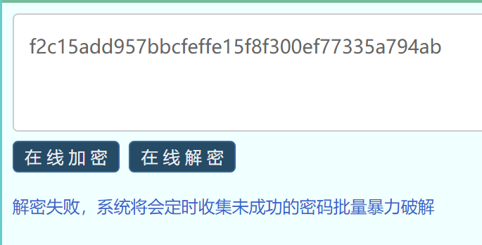
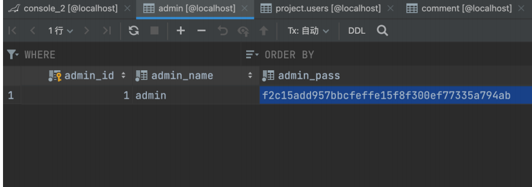
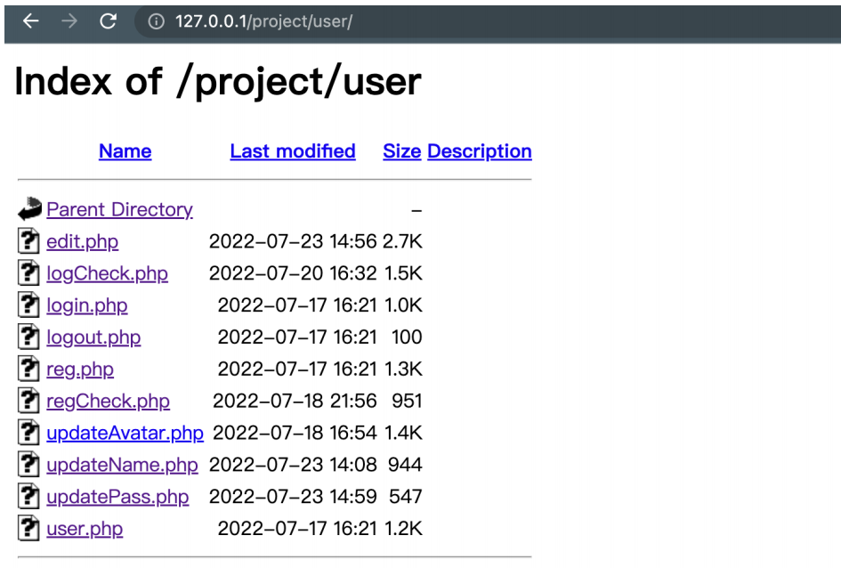
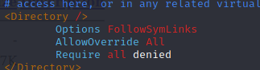
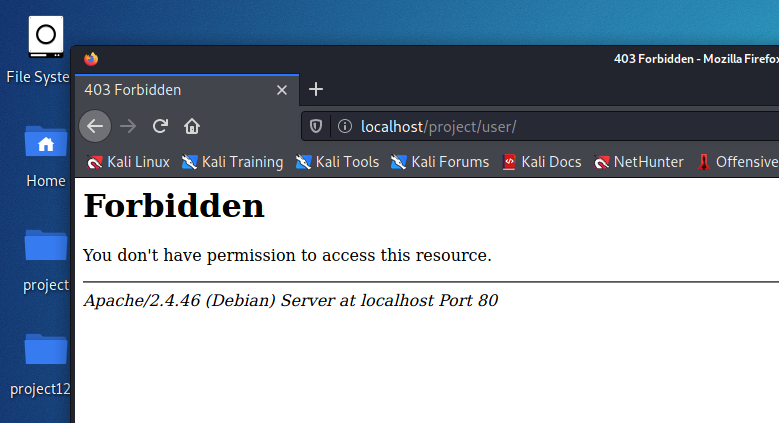
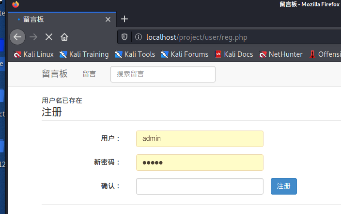
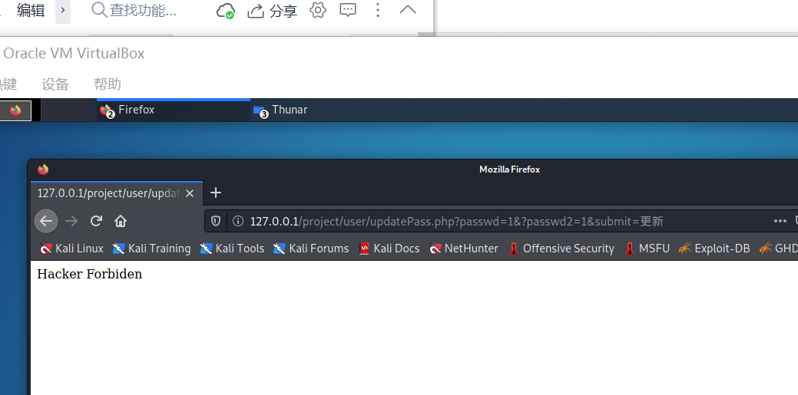

## 1.后台弱口令

### 漏洞描述

在管理员登录中，使用用户名admin，密码admin可直接登录

### 漏洞产生原因

由于系统超级管理员密码不可直接更改，且系统在数据库初始化时默认密码为 `admin` ,如果不另行修改，则会产生弱口令漏洞

### 漏洞修复

由于系统超级管理员密码不可更改，需要去数据库进行操作。系统密码为 SHA1 加密后存储在数据库中。所以设置新密码为 `Ab4$6*cD` (只可加密不能通过在线工具解密，仍需进一步爆破，安全性更高),利用工具进行 SHA1 运算后，写入数据库。





## 2.目录遍历

### 漏洞描述

访问网站根目录下 `/user、/images、/css、/js ` 等文件夹，会直接出现目录索引



### 漏洞产生原因

根据源代码可知，目录遍历产生的原因是因为 Apache 配置文件配置错误导致，需修改网站服务目录下每个 `.htaccess` 文件为正确的配置

### 漏洞修复

**原 `.htaccess` 文件内容**

```
Options -Indexes
```

**修改后的 `.htaccess` 文件内容**

```shell
 <Files *>
  Options -Indexes
 </Files>
```

**更改apache2.conf**



**修复后的页面**



## 3.权限跨越漏洞

### 漏洞描述

在用户名更新功能中，可以任意更改为系统中已存在的用户名。并且在更改后，可以直接以已存在的用户名登录，造成权限跨越漏洞

### 漏洞产生原因

在用户更新用户名功能的后台代码中的判断用户是否存在相关代码中，代码书写错误，导致任何用户名均可进行直接更改

### 漏洞修复

**原存在漏洞的代码**

```php
	$query = "SELECT * FROM users WHERE user_name = 'clean_username'";
    $data = mysqli_query($dbc, $query);
	if (mysqli_num_rows($data) == 1) {
		$_SESSION['error_info'] = '用户名已存在';
		header('Location: edit.php');
	}
```

由于 `$query` 语句中 `clean_username` 书写错误，导致 `if (mysqli_num_rows($data) == 1)` 只有在 username 为 clean_username 时才会导致if不成立，从而无法修改。而其他用户名均可直接修改，导致漏洞。

**修复后的代码**

```php
	$query = "SELECT * FROM users WHERE user_name = '$clean_username'";//修复一
    $data = mysqli_query($dbc, $query);
	if (mysqli_num_rows($data) >= 1) { //修复2
		$_SESSION['error_info'] = '用户名已存在';
		header('Location: edit.php');
        exit('err');
	}
```

1. 修复一

   将 `clean_username` 改为 php 变量 `$clean_username`

2. 修复二

   将判断改为 `>=` 增加程序鲁棒性



## 4.CSRF漏洞

### 漏洞描述

漏洞存在于用户密码修改功能中

如正常用户在登录系统时无意点击恶意构造链接如 `http://127.0.0.1/project/user/updatePass.php?passwd=555&passwd2=555&submit=%E6%9B%B4%E6%96%B0`，可能会被直接改密码

### 漏洞产生原因

在用户点击恶意构造的链接后，服务器并不能准确校验是不是用户正常使用该功能

### 漏洞修复

1. 在后端代码中，增加一个 `getToken` 函数，用来产生随机的 token

   ```php
   function getToken($len = 32, $md5 = true)
   {
       mt_srand((double)microtime() * 1000000);
       $chars = array(
           'Q',
           '@',
           '8',
           'y',
           '%',
           '^',
           '5',
           'Z',
           '(',
           'G',
           '_',
           'O',
           '`',
           'S',
           '-',
           'N',
           '<',
           'D',
           '{',
           '}',
           '[',
           ']',
           'h',
           ';',
           'W',
           '.',
           '/',
           '|',
           ':',
           '1',
           'E',
           'L',
           '4',
           '&',
           '6',
           '7',
           '#',
           '9',
           'a',
           'A',
           'b',
           'B',
           '~',
           'C',
           'd',
           '>',
           'e',
           '2',
           'f',
           'P',
           'g',
           ')',
           '?',
           'H',
           'i',
           'X',
           'U',
           'J',
           'k',
           'r',
           'l',
           '3',
           't',
           'M',
           'n',
           '=',
           'o',
           '+',
           'p',
           'F',
           'q',
           '!',
           'K',
           'R',
           's',
           'c',
           'm',
           'T',
           'v',
           'j',
           'u',
           'V',
           'w',
           ',',
           'x',
           'I',
           '$',
           'Y',
           'z',
           '*'
       );
       $numChars = count($chars) - 1;
       $token = '';
       for ($i = 0; $i < $len; $i++)
           $token .= $chars[mt_rand(0, $numChars)];
       if ($md5) {
           $chunks = ceil(strlen($token) / 32);
           $md5token = '';
           for ($i = 1; $i <= $chunks; $i++)
               $md5token .= md5(substr($token, $i * 32 - 32, 32));
           $token = substr($md5token, 0, $len);
       }
       return $token;
   }
   ```

2. 在用户修改信息页面，即 `edit.php` 中，增加如下代码，初始化 CSRFtoken，并将 CSRFtoken 存入于 session 中。

   ```php
   //设置CSRFtoken
   $token = getToken();
   $_SESSION['token'] = $token;
   ```

3. 在用户修改信息页面，即 `edit.php` 中修改密码 `form` 表单中，增加隐藏的 input 标签，用来放置 CSRFtoken。

   ```php+HTML
   <input type="hidden" name="token" value="<?=$token?>" />
   ```

4. 在 `updatePass.php` 中，增加 CSRFtoken 校验，于 session 中 token字段进行比较

   ```php
   if($_GET['token'] == $_SESSION['token']){
       unset($_SESSION['token']);
   }else{
       die("Hacker Forbiden");
   }
   ```

**漏洞修补后**



## 备注
- 后台弱口令漏洞因设置的原密码在sql注入漏洞攻击得到密文后无法通过在线解密直接破解，所以组员后续更改了密码，但仍比admin/admin这样的弱口令要复杂。